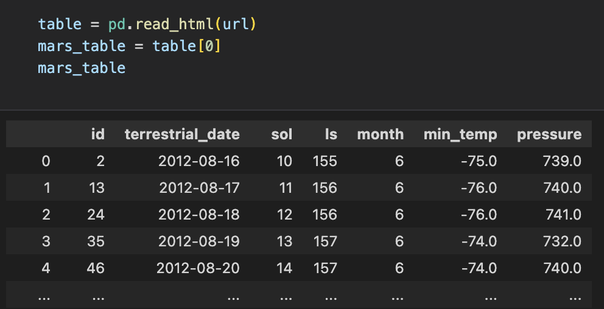
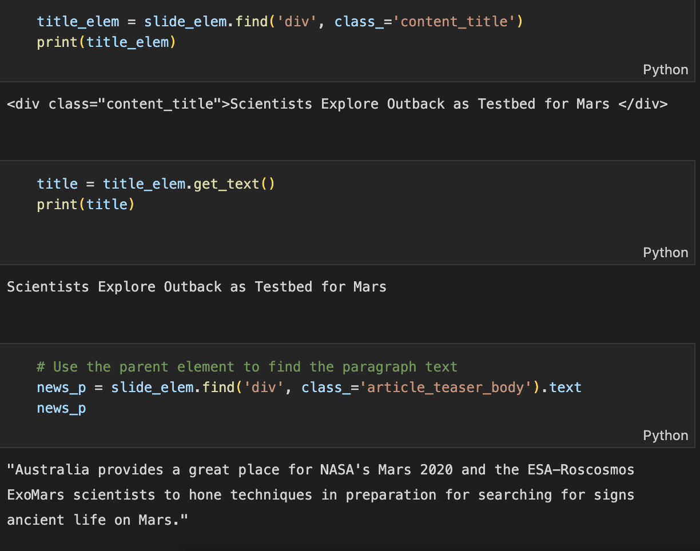
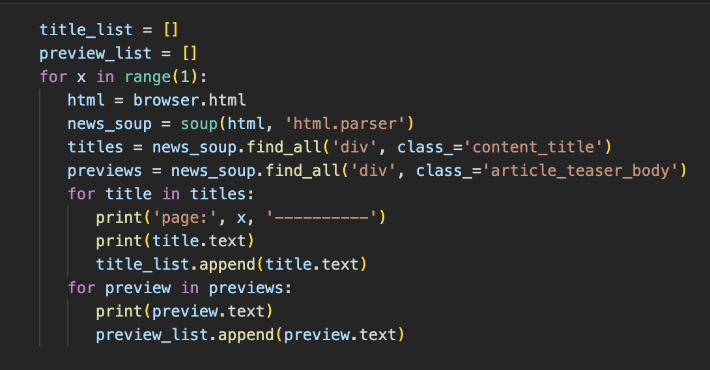

# Mission to Mars!: Webscraping HTML Elements with Splinter, Beautiful Soup, and Python

This is a classwork example in which web scraping is performed to gather information about Mars for "SpaceForward", a (fake) aerospace company that is researching resource extraction from nearby planets. I collected general and mission related news items and information to be used for future database queries. 

---
## Summary 

Using Python and webscraping techniques, a table holding Mars facts was created. News information can also be easily extracted in one piece or through an iteration.

### New table of Mars info created using webscraping:

### News info extracted piece by piece:

### News info extracted through an iteration:

